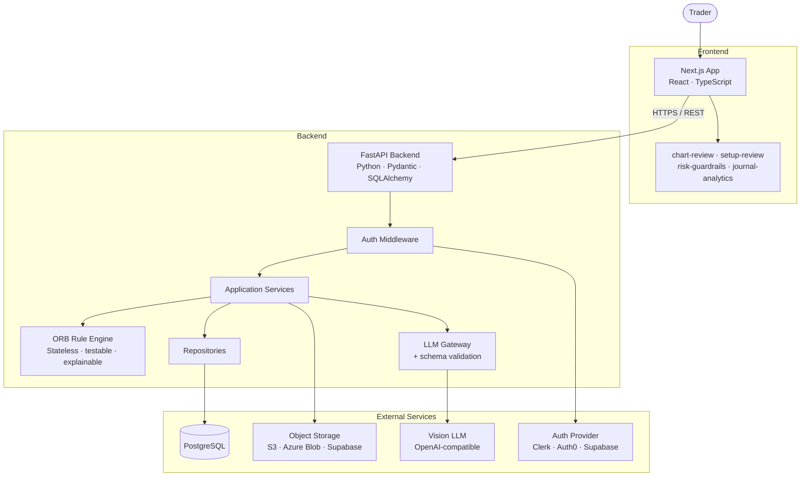
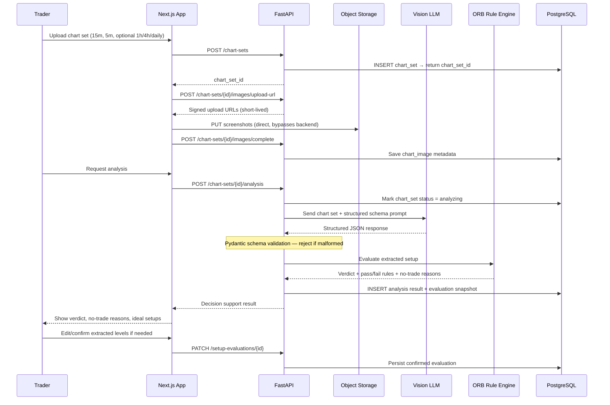
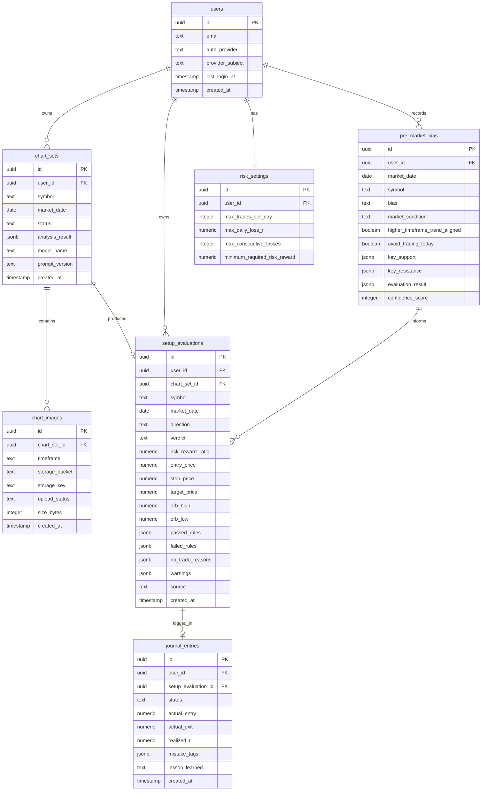
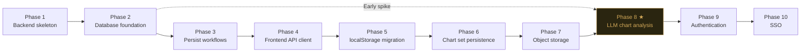
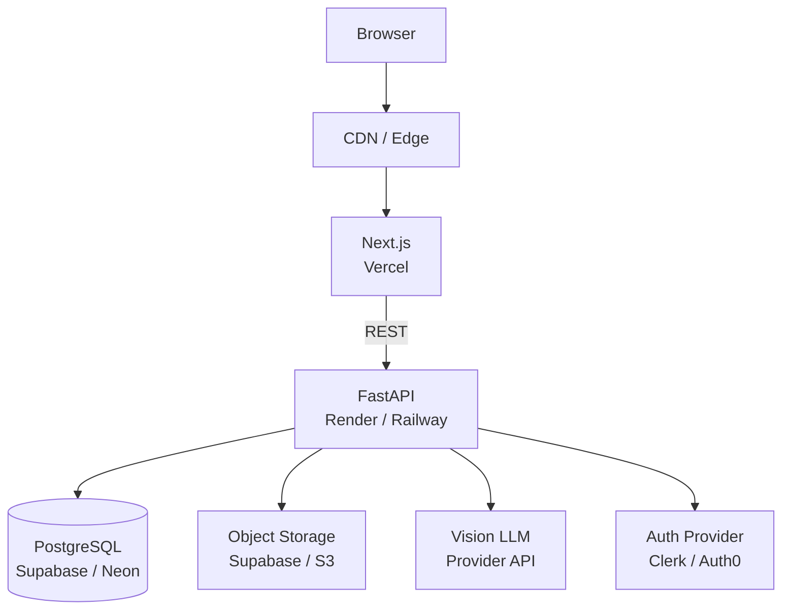

# ORB Decision Support System

> **System Architecture Document · v1.0 · Greenfield**

End-state architecture for a multi-timeframe Opening Range Breakout trading workflow — with AI-assisted chart interpretation, structured rule evaluation, and enforced risk discipline.

|                      |                                         |
| -------------------- | --------------------------------------- |
| **Stack**            | Next.js · FastAPI · PostgreSQL          |
| **AI layer**         | Vision LLM + ORB Rule Engine            |
| **Design principle** | Decision-support, not black-box signals |
| **Status**           | Pre-implementation — greenfield         |

---

## Table of Contents

1. [Purpose & Design Philosophy](#1-purpose--design-philosophy)
2. [High-Level Architecture](#2-high-level-architecture)
3. [Major Components](#3-major-components)
4. [End-to-End User Flow](#4-end-to-end-user-flow)
5. [Core Data Model](#5-core-data-model)
6. [API Surface](#6-api-surface)
7. [Security Architecture](#7-security-architecture)
8. [Architectural Decisions](#8-architectural-decisions)
9. [Implementation Roadmap](#9-implementation-roadmap)
10. [Deployment Stack](#10-deployment-stack)

---

## 1. Purpose & Design Philosophy

The ORB Decision Support System is a **trading workflow application**, not an algorithmic signal generator. The distinction is intentional and load-bearing: the system must help a trader think better, not replace their judgment.

> **Core product promise:** Upload chart context → receive structured ORB/TTC analysis → understand whether the current setup is valid or no-trade → see exactly what a better trade would need to look like.

The AI layer extracts and explains chart context. The **rule engine** validates the trade. Every verdict is explainable. Every no-trade condition has a named reason. This prevents the product from drifting into black-box territory, which erodes trust and discipline.

### Discipline enforced by the system

The system is specifically designed to enforce guardrails around:

- Pre-market bias alignment
- Opening range structure
- Breakout and retest quality
- Risk/reward thresholds
- Daily loss limits
- No-trade conditions
- Post-trade journaling

> ⚠️ **Design constraint:** The application should never output `"Buy here."` It must output: _"Current setup: No trade. Reasons: retest failed, resistance overhead, R/R below threshold. A valid long would require X, Y, Z."_

---

## 2. High-Level Architecture

The system is a modular client-server application. The frontend owns user experience, the backend owns persistence and AI orchestration, and the two interact through a well-defined API boundary.



### Architectural principles

| Principle                                  | Detail                                                                                 |
| ------------------------------------------ | -------------------------------------------------------------------------------------- |
| **Frontend owns UX**                       | Never calls LLM directly, never stores API keys, never makes auth decisions            |
| **Backend is the trust boundary**          | All persistence, authorization, AI orchestration, and storage access is gated here     |
| **AI output is untrusted until validated** | LLM responses are schema-validated before any downstream use                           |
| **Rule engine is explicit and testable**   | Trading logic lives in deterministic code, not LLM prompts                             |
| **Evaluation snapshots are immutable**     | Historical records preserve exactly what the system told the trader at that moment     |
| **Screenshots stay private**               | Files go to object storage; the database only holds metadata and signed URL references |

---

## 3. Major Components

### 3.1 Next.js Frontend

The frontend is the trader's workstation. It owns all user-facing concerns — chart uploads, setup review, risk display, and the journal — but delegates all persistence and intelligence to the backend.

> 🚫 **Never in the frontend:** direct LLM calls · stored API secrets · auth decisions · trusted `user_id` · durable trading history as source of truth

Feature areas follow a bounded structure under `src/features/`:

```
src/features/
├── chart-review/
├── setup-review/
├── risk-guardrails/
├── setup-history/
├── journal-analytics/
└── pre-market-bias/
```

### 3.2 FastAPI Backend

The backend is the secure application boundary. It is the only component that holds LLM API keys, database credentials, and makes authorization decisions.

```
backend/app/
├── main.py
├── api/routes/
│   ├── chart_sets.py
│   ├── chart_images.py
│   ├── chart_analysis.py
│   ├── setup_evaluations.py
│   ├── journal_entries.py
│   ├── risk_settings.py
│   ├── pre_market_bias.py
│   └── health.py
├── core/
│   ├── config.py
│   └── security.py
├── models/
├── schemas/
├── services/
│   ├── chart_analysis_service.py
│   ├── setup_evaluation_service.py
│   ├── risk_guardrail_service.py
│   ├── storage_service.py
│   └── llm_service.py
├── repositories/
└── tests/
```

### 3.3 ORB Rule Engine

The rule engine is the most critical component for product integrity. It is **stateless, deterministic, and fully unit-testable** — all trading logic must live here, not in prompts.

> 💡 **Key principle:** The AI extracts chart context. The rule engine validates the trade. These responsibilities must never be combined into a single LLM call that outputs a buy/sell verdict.

The engine evaluates:

- Opening range setup validity
- Breakout and retest conditions
- Direction alignment with pre-market bias
- Risk/reward calculation
- Daily guardrail compliance

It produces a structured verdict with named pass/fail rules, no-trade reasons, and a confidence level derived from hard rule outcomes — **not** from LLM self-assessment.

### 3.4 LLM Analysis Gateway

A dedicated adapter layer sits between the backend services and the LLM provider. It:

- Isolates provider-specific implementation details
- Enforces strict output schema validation
- Stores prompt version and model metadata alongside every analysis result

> ⚠️ **Important:** `confidenceLevel` in the AI output contract should be treated as a hint, not a trusted value. LLMs are not well-calibrated on their own confidence. Derive the confidence score from rule engine outputs instead.

#### AI output contract

```typescript
type ChartAnalysisResult = {
  extractedContext: {
    symbol: string | null;
    marketDate: string | null;
    timeframesReviewed: ChartTimeframe[];
    orbHigh: number | null;
    orbLow: number | null;
    currentPrice: number | null;
    higherTimeframeBias: 'bullish' | 'bearish' | 'neutral' | 'unclear';
    marketCondition: 'trending' | 'choppy' | 'range-bound' | 'unclear';
    keySupportZones: PriceZone[];
    keyResistanceZones: PriceZone[];
    liquidityNotes: string[];
  };
  currentSetup: {
    verdict: 'valid' | 'no-trade' | 'wait';
    direction: 'long' | 'short' | 'none';
    breakoutStatus: string;
    retestStatus: string;
    noTradeReasons: string[];
    warnings: string[];
    confidenceLevel: 'low' | 'medium' | 'high'; // treat as hint only
    ruleExplanations: string[];
  };
  idealTradeGuidance: {
    idealLongScenario: TradeScenario | null;
    idealShortScenario: TradeScenario | null;
  };
};

type TradeScenario = {
  entryZone: PriceZone | null;
  stop: number | null;
  targets: number[];
  invalidation: string[];
  confirmationNeeded: string[];
  explanation: string;
};
```

### 3.5 PostgreSQL

Stores all durable structured data. Key conventions:

- Every table carries `user_id` — non-negotiable for ownership enforcement and SSO-readiness
- JSONB for evolving structures (rule outputs, analysis results, evaluation snapshots)
- Important query fields (`symbol`, `market_date`, `verdict`, `risk_reward_ratio`) remain as columns

### 3.6 Object Storage

Private object storage (S3 / Azure Blob / Supabase Storage) holds chart screenshots. Metadata lives in PostgreSQL; files never live in the database.

---

## 4. End-to-End User Flow



---

## 5. Core Data Model



### Key schema decisions

**Why JSONB for rule outputs (`passed_rules`, `failed_rules`, `no_trade_reasons`)?**

Rule logic will evolve. Storing rule results in JSONB preserves exactly what the system told the trader at that moment — which is the ground truth for post-trade review. A schema migration should never retroactively change a historical verdict.

**On `setup_evaluations` lifecycle:**

`entry_price`, `stop_price`, and `target_price` may come from AI extraction before the trader has confirmed them. Add a `source TEXT` field (`'ai' | 'manual' | 'confirmed'`) to track lifecycle state and prevent acting on unconfirmed AI-extracted values.

---

## 6. API Surface

All endpoints are prefixed `/api/` and require authentication after Phase 9. The backend derives `user_id` from auth context — **never** from the request body.

### Chart sets

```
POST   /api/chart-sets                              Create chart set
GET    /api/chart-sets                              List user's chart sets
GET    /api/chart-sets/{id}                         Get chart set
PATCH  /api/chart-sets/{id}                         Update chart set
DELETE /api/chart-sets/{id}                         Delete chart set
```

### Chart images

```
POST   /api/chart-sets/{id}/images/upload-url       Request signed upload URL
POST   /api/chart-sets/{id}/images/complete         Confirm upload + save metadata
DELETE /api/chart-sets/{id}/images/{image_id}       Delete image
```

### Analysis

```
# Simple (sync) — start here
POST   /api/chart-sets/{id}/analysis                Trigger analysis
GET    /api/chart-sets/{id}/analysis                Get analysis result

# Scalable (async) — switch when LLM latency matters
POST   /api/chart-sets/{id}/analysis-jobs           Dispatch analysis job
GET    /api/analysis-jobs/{job_id}                  Poll job status
```

> **Async consideration:** Start with the synchronous `/analysis` endpoint. Switch to the job queue pattern once LLM latency becomes noticeable or you need concurrent users. The schema stays the same; only the transport changes.

### Setup evaluations

```
POST   /api/setup-evaluations                       Create evaluation
GET    /api/setup-evaluations                       List evaluations
GET    /api/setup-evaluations/{id}                  Get evaluation
PATCH  /api/setup-evaluations/{id}                  Update / confirm evaluation
DELETE /api/setup-evaluations/{id}                  Delete evaluation
```

### Journal

```
POST   /api/setup-evaluations/{id}/journal          Attach journal entry
PATCH  /api/journal-entries/{id}                    Update journal entry
GET    /api/journal-entries                         List journal entries
```

### Risk & bias

```
GET    /api/risk-settings                           Get risk settings (unique per user)
PUT    /api/risk-settings                           Upsert risk settings

POST   /api/pre-market-bias                         Create bias record
GET    /api/pre-market-bias?market_date=&symbol=    Get bias for date/symbol
PUT    /api/pre-market-bias/{id}                    Update bias record
DELETE /api/pre-market-bias/{id}                    Delete bias record
```

### System

```
GET    /api/health                                  Liveness probe
```

---

## 7. Security Architecture

### Requirements

| Requirement                             | Implementation                                                         |
| --------------------------------------- | ---------------------------------------------------------------------- |
| `user_id` derived from auth context     | Backend extracts from JWT/session — never from request body            |
| LLM + DB credentials backend-only       | Never in frontend code, never in client env vars                       |
| Private file access                     | All screenshots served via short-lived signed URLs                     |
| LLM output validated before persistence | Pydantic schema validation; malformed/injected responses rejected      |
| AI endpoint rate limiting               | Per-user quotas in middleware, not just at provider level              |
| File validation on upload               | MIME type and size checked before storage                              |
| Audit trail                             | `prompt_version`, `model_name`, `analysis_version` stored per analysis |
| HTTPS in production                     | Required; no HTTP fallback                                             |

### Threats mitigated

- User accessing another user's setups → row-level ownership on every query
- Public exposure of chart screenshots → private bucket + signed URLs only
- LLM prompt injection or malformed output → schema validation layer
- Excessive AI usage / cost abuse → rate limiting per user
- Frontend secrets leakage → secrets live only on backend
- Invalid file uploads → MIME type + size validation at upload

### Auth design

```
External identity provider
        ↓
users.provider_subject  (OIDC sub claim)
        ↓
users.id                (internal UUID, used on all tables)
```

The auth provider can be swapped without a database migration — only the mapping layer changes. Add `user_id` to all tables from day one; add SSO later.

---

## 8. Architectural Decisions

| Decision                | Choice                                  | Rationale                                                                                                            |
| ----------------------- | --------------------------------------- | -------------------------------------------------------------------------------------------------------------------- |
| **Backend framework**   | FastAPI over Next.js API routes         | Python-native AI tooling, strong Pydantic validation, cleaner LLM orchestration, background jobs ready               |
| **Primary data store**  | PostgreSQL over localStorage            | Durable, cross-device, analytics-ready, SSO-compatible. localStorage useful only as draft cache and migration source |
| **File storage**        | Object storage over DB blobs            | Databases are poor file stores. Signed URLs are standard. Storage scales independently                               |
| **AI role**             | Decision support over signal generation | Black-box signals erode discipline. Explainable verdicts with named rules preserve the trader's agency and trust     |
| **Confidence scoring**  | Rule engine, not LLM self-assessment    | LLMs are not calibrated on their own confidence. Derive scores from deterministic rule pass/fail outcomes            |
| **Rule output storage** | JSONB snapshot per evaluation           | Rules evolve. Historical records must reflect what the system said at that time, not the current rule set            |

---

## 9. Implementation Roadmap

> **Note:** Phase 8 (LLM chart analysis) is the core value proposition. The earlier phases are necessary infrastructure, but **validate the AI loop early** — after Phase 2, build a minimal Phase 8 spike before investing in auth and migration work.



| Phase    | Name                       | Deliverables                                                                                     |
| -------- | -------------------------- | ------------------------------------------------------------------------------------------------ |
| **01**   | Backend skeleton           | FastAPI app · `/health` · CORS · env config · pytest baseline                                    |
| **02**   | Database foundation        | PostgreSQL · SQLAlchemy/SQLModel · Alembic migrations · base models                              |
| **03**   | Persist existing workflows | Setup evaluations · journal entries · risk settings · pre-market bias                            |
| **04**   | Frontend API client        | API service wrappers · repo abstraction · local vs remote boundary                               |
| **05**   | localStorage migration     | Detect · validate · upload to backend · mark migrated                                            |
| **06**   | Chart set persistence      | `chart_sets` · `chart_images` metadata · no AI yet                                               |
| **07**   | Object storage             | Signed upload URLs · private bucket · upload completion endpoint                                 |
| **08 ★** | LLM chart analysis         | LLM adapter · structured output schema · prompt versioning · schema validation · ORB rule engine |
| **09**   | Authentication             | Auth provider integration · user ownership enforcement on all routes                             |
| **10**   | SSO                        | OIDC integration · external identity mapping · org support if needed                             |

> 💡 **Recommendation:** After Phase 2, build a minimal Phase 8 spike — a single FastAPI endpoint that accepts a chart image, calls the LLM, validates the output schema, and returns a structured verdict. This validates the hardest assumption (LLM output quality and latency) before committing to the full persistence and frontend build.

---

## 10. Deployment Stack

### Recommended early production stack

| Layer          | Primary                        | Alternative                               |
| -------------- | ------------------------------ | ----------------------------------------- |
| Frontend       | Vercel                         | Netlify                                   |
| Backend API    | Render or Railway              | Fly.io · AWS ECS · Azure App Service      |
| Database       | Supabase Postgres              | Neon · Railway Postgres · AWS RDS         |
| Object storage | Supabase Storage               | AWS S3 · Azure Blob                       |
| Auth           | Clerk                          | Supabase Auth · Auth0                     |
| LLM            | OpenAI-compatible vision model | Anthropic Claude (vision) · Google Gemini |

### Production topology



### Observability (minimum logging fields)

Every request should log: `request_id` · `user_id` · `endpoint` · `status_code` · `latency_ms` · `error_type` · `chart_set_id` · `analysis_job_id` · `model_name` · `prompt_version`

> 🚫 **Never log:** API secrets · raw auth tokens · full private screenshots · sensitive user text beyond what is needed for debugging

### Testing strategy

| Layer                    | Focus                                                                                                                                                                               |
| ------------------------ | ----------------------------------------------------------------------------------------------------------------------------------------------------------------------------------- |
| **Frontend**             | Chart upload UI · setup review flow · risk guardrail display · history table · API error states · empty states                                                                      |
| **Backend**              | Route validation · service logic · repository logic · auth ownership · upload URL generation · chart analysis lifecycle · malformed LLM response handling                           |
| **Domain (rule engine)** | ORB setup rules · risk/reward calculation · daily guardrails · pre-market bias alignment · chart set validation                                                                     |
| **AI**                   | Use mocked LLM responses in automated tests. Never call real LLMs in CI. Use fixed fixture screenshots and golden JSON responses for schema validation and prompt regression tests. |

---

_ORB Decision Support System · Architecture v1.0 · Greenfield · Last updated May 2025_
